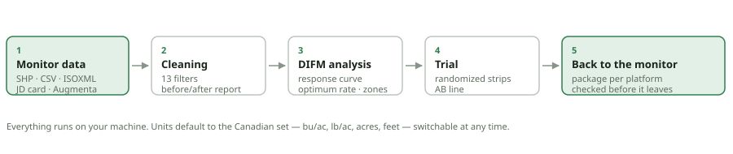

# AgroSuite

A local application for working with agricultural monitor data: design the
on-farm trial and export it to the monitor, import what comes off the machine,
clean harvest and application maps with a report of what was removed, work out
what the trial earned, and generate the files to take back to the monitor —
already laid out the way each terminal expects.

Everything runs on your computer. No data leaves the machine: the server
listens only on `127.0.0.1` and the files live in a session folder.



## Installing on Windows

1. Install [Python 3.10 or newer](https://www.python.org/downloads/), ticking
   **Add Python to PATH** during installation.
2. Download or clone this folder.
3. Double-click **`run.bat`**.

The first run creates the environment and installs the dependencies (a few
minutes). After that the app opens straight in your browser.

On Linux or macOS, use `./run.sh`. On any system this also works:

```
pip install -r requirements.txt
python -m agrosuite
```

## Units

The app opens in the **Canadian default**: bu/ac for grain, lb/ac for
fertilizer and seed, acres, feet, mph and Canadian dollars. You can switch
the whole set from the picker at the top (Canada, United States, Brazil,
metric) or adjust each quantity through the ⚙ button.

Internally everything is stored in metric — kg/ha, hectares, metres, km/h.
Conversion happens only at display and at write time, so switching from acres
to hectares changes no stored number and requires no reload.

Bushel units depend on the crop, because a bushel measures volume: a bushel
of canola weighs 22.68 kg and one of wheat 27.22 kg. Pick the crop in the
same panel.

## How the work flows

There are two tracks, a season apart, and the app serves both.

**Plan a trial**, before the season: load a boundary or a field file, set the
rates, the plot size, the replications and the direction, generate the layout
and the AB lines, and export the package to the monitor. Nothing in this track
needs a yield map, prices or cleaning.

**Evaluate a trial**, after harvest: load the as-applied and the yield map —
and the plan, if there is one — review the units and the roles, clean, work out
the economics, export.

The **relief** of the field serves both, from the altitude the files already
carry: before the season it says which way the ground falls and where the
water sits, which is half of where the strips should run; after it, it
explains the low corner of the yield map.

Neither track is a gate. Every tab is clickable at any time; a tab that cannot
do its work yet says in its own panel what is missing and offers the one button
that fixes it. **Each step can be the last one**: looking at the data and
stopping is a complete use of the app, so is cleaning a file and exporting the
clean copy, and a file that arrives already clean goes straight to Economics.
Each tab ends with what it produces on its own and how to take it away.

The order the tabs are in is still the order that costs least when the whole
job is done at once — declaring the units before cleaning keeps the wrong ones
out of the clean copy, and cleaning before fitting keeps overlap and headland
turns out of the curve. It is a recommendation, not a lock.

The stage strip along the top says which track the project is on, where the
work has got to and what is worth doing next — as an offer, with every stage
one click away whether it has been reached or not.

A **project** is the set of files describing one field and season. The economic
analysis needs several — the plan that was made, the as-applied log of what
the machine did, the yield map of what came of it, and the prices that turn
yield into money. The panel on the left names whichever is absent, instead of
failing three screens later.

Every file gets a **first look** the moment it opens: coverage, timeline,
completeness, data quality, and above all whether the units are what they
seem. A median yield of 55 on a canola map is bu/ac, not kg/ha, and reading it
wrong puts every number downstream out by a factor of fifty. The check judges
the value, the speed and the width together, because a monitor is configured
as one system and agreement between three quantities is far stronger evidence
than any one alone.

Layers from separate files are **joined on a shared grid** rather than point
to point. Three passes over the same ground never line up, and matching
nearest neighbours would pair a yield reading with whichever rate record
happened to be closest. Two details make the join trustworthy: every grid is
anchored to the same origin, and a cell takes the rate level most of its
records agree on rather than their mean — a cell half at 60 and half at 120
would otherwise come out at 90, a treatment nobody applied.

## The tabs

**Data · Terrain · Trial design · Cleaning · Economics · Export.** They carry
no numbers, because no order is required.

### Data

It takes what the monitor produces:

| Source | Format |
|---|---|
| John Deere | Operations Center shapefile and CSV, the USB zip, GS2/GS3/Gen 4 cards |
| Ag Leader / SMS | shapefile and CSV |
| Raven Viper 4 | job CSV, shapefile |
| Trimble GFX / TMX / FmX | coverage CSV, shapefile |
| Case IH AFS, New Holland PLM | ISOXML (TASKDATA plus binary TLG logs) |
| Bourgault X30/X35, Väderstad, Topcon/Müller | ISOXML, CSV |
| Augmenta | session GeoJSON, carrying vigour and rate |
| Anything else | shapefile, GeoJSON, CSV/TXT, Excel, KML/KMZ, ZIP |

The app identifies the manufacturer from the column signature and the folder
structure, converts everything to one schema, and reconstructs what is
missing — speed and heading come from the track itself when the file does not
carry them.

A shapefile or an ISOXML folder needs all of its files together: use **Open
by path / folder**, or upload a `.zip`.

### Terrain

Every yield and as-applied file carries a GPS height on every point, and
nobody looks at it, because scattered heights along a track say nothing on
their own. Put them on a grid and they answer the questions that get asked
out loud: where does the water sit, which way does the field fall, which end
washes, where is the ground too steep to work across. No survey, no drone,
no LiDAR tile — the file you already have.

**Analyse the relief** answers in sentences first: what kind of field it is,
which way and how far it falls, each hill and each low with its size and
height, each closed depression with the volume it holds before it spills,
how much ground is likely wet. Then it draws them — twelve map layers
(elevation, slope, aspect, hillshade, two scales of topographic position,
wetness, landform, two curvatures, ponding depth and flow accumulation),
contour lines labelled in your own units, the outlines of the features with
their numbers in a popup, a slope histogram against the agronomic classes,
an aspect rose, and the profile of the ground along any line you click
across the field.

**Yield against the relief** answers the question the relief raises: the
yield map read at the height each reading was harvested at, band by band,
by landform, by slope class and by wet or well-drained ground — with the
correlation that says, honestly, how much of the season the relief explains
at all, and a line saying that one season on one field is not a cause. The
yield map can be the same file whose altitude was analysed, or a separate
one beside a DEM.

**Make zones from this** turns the relief into an ordinary dataset — by
landform, slope class, elevation band or wetness, as points or polygons —
which exports to the monitor like any other map; give it a rate per zone
first, because a file whose rate column holds 1, 2 and 3 is a map of class
codes and the terminal will apply it as written. The whole analysis also
leaves as one zip for QGIS: a GeoTIFF per layer, the contours, the features
and the drainage lines, with a README naming each file.

A DEM GeoTIFF is the better source when there is one, and it goes through
the same chain — opened like any other file and read at the raster's own
resolution.

GPS altitude is the least reliable number in a monitor file: a consumer
receiver reporting height above an ellipsoid while the machine bounces
through the field. The analyser drops the readings that are not heights,
discards a pass sitting away from the rest, solves and removes the offset
every headland turn leaves behind, and then measures the noise that is left
— and ties every threshold it uses to that number, so a bump smaller than
the noise is not reported and a field with no relief is reported as level
rather than contoured into nonsense. The shape of the relief is sound; the
absolute heights are only as good as the receiver, which without an RTK
correction means a few tens of centimetres.

The reference for the whole feature — the endpoints, the layers with their
units and palettes, the landform codes and the zone datasets — is in
[docs/terrain.md](docs/terrain.md).

### Trial design

It generates randomized block strips over the field boundary: width a multiple
of the implement, rates drawn within each block, direction aligned to the
longest side. It also generates the **AB line** along the strip direction —
without it the operator enters at another angle and the trial is lost.

This is the whole of the pre-season work, and it needs nothing else: a
boundary — or any layer whose outline can stand for the field, or a shape
drawn on the map — is enough to lay the strips out and build the package the
terminal reads.

### Cleaning

Thirteen chained filters, with a starting profile per operation type:

- null and non-positive values, inconsistent positions, moisture out of range;
- speed outside the operating range, and sharp speed changes;
- partial swath, short passes, pass starts and ends;
- **swath overlap** — the main source of false low values in a yield map;
- **field edge**, measured by a distance transform over the worked area, which
  follows irregularly shaped fields;
- global and local outliers.

Before the filters comes the **flow delay** correction: several seconds pass
between the cut and the sensor, and without shifting the series the whole map
ends up several metres out of place.

Nothing is overwritten. Cleaning produces two new datasets — *clean* and
*removed*, the latter carrying the reason for each discard — plus a report
with before and after, an overlaid histogram, and what each filter took out.
The report can also put the field before and after side by side on the map,
locked together and on one colour scale; hovering any point, on any map,
shows its value in the chosen unit, or the reason it was removed.

### Economics

The analysis of an on-farm trial: a yield response curve fitted to the rates
the trial applied, and the ratio between the crop price and the input cost
that says where the next unit of input stops paying for itself.

It aggregates the points into cells (never mixing rates from neighbouring
strips), drops the transition between treatments, fits four response models —
quadratic, quadratic plateau, linear plateau and Mitscherlich — and picks the
one with the best R².

Given a crop price and an input cost, it computes the **economic optimum
rate**. Given a zone column, it fits one curve per zone and compares variable
rate profit against the best single rate — which is the number that decides
whether the map is worth building. The result prints as the **economic
report**, and becomes a prescription in one step.

Cleaning is not a precondition here: a file that is already clean — one this
app cleaned in an earlier session, or an aggregated export — comes straight to
this tab.

### Export

Two modes.

**Ready-to-load package** builds the USB folder in the layout the chosen
platform looks for, with boundary, AB lines and prescription, plus a
`README.txt` naming the import path. Whatever the platform does not accept is
left out and reported — better to know here than in the cab.

**Individual files** generates only what you ask for, with no folder
structure.

## Machine profiles

A header width, a flow delay and a working speed belong to the machine, not
to the field, yet the cleaning, the trial design and the export each ask for
one of them. Typing "60 ft, 12 s" for the third time this season is how a 6
sneaks in for a 60. A **machine** is entered once and picked from a small row
on each of those tabs: choosing it fills the fields that tab needs — flow
delay and speed range on Cleaning, implement width and passes per strip on
Trial design, the target monitor on Export — in whatever units you chose.

**Save as machine…** reads the current settings back into a short form;
**Suggest from this file** prefills it from the selected dataset (median
swath, 2nd–98th percentile speed, the monitor that wrote the file). Nothing
is saved until you press Save, a name already in the list is replaced only
after asking, and a profile that cannot work is refused with the reasons
listed, all at once. With a machine picked, the same button reads **Update
machine…** and opens on that machine, so a header swapped mid-season is
corrected in place rather than retyped.

Profiles outlive the session: they live in `~/.agrosuite/profiles.json`
(set `AGROSUITE_HOME` to keep them elsewhere, e.g. on a shared drive), as
plain indented JSON in metric units, so the file can be read, edited or
copied to another computer with a text editor. A file the app cannot read is
refused, not overwritten; a profile typed into it that the app would refuse
to save is listed as *needs attention* and not applied until it is fixed.

## Check before you take it out

Every package goes through an automatic check, run **over the files already
written** rather than over what was meant to be written. It covers the known
causes of rejection, one by one:

- shapefile: `.shp`/`.shx`/`.dbf`/`.prj` present, polygon geometry, valid
  polygons, projection, field names within the DBF limit, rate field present,
  numeric, with no nulls and no negatives, plausible magnitude, character
  encoding declared, size and feature count;
- ISOXML: folder and file named exactly, valid XML, closed rings, AB lines
  carrying both reference points, grid binary length matching what the header
  declares, cells carrying a rate, DDI declared.

The result comes in three levels: **checked**, **to confirm on the monitor
screen** and **blocker**. Nothing claims "this will work" — the check claims
that the known causes of failure have been ruled out. Firmware version and
import menus cannot be tested from here.

## Straight to the USB stick

The Export tab finds the removable drives, shows what is already on each one,
and copies the package to the root — which is where the terminal looks.
Anything already on the drive is left alone unless you say to replace it: a
stick normally carries other jobs, and wiping them because the app assumed it
was scratch space would be unforgivable.

## QGIS

Two directions, both of which come up.

**Out of AgroSuite:** the Export tab writes every loaded layer into one
GeoPackage plus a `.qgs` project. Open the project to get all the layers at
once; if your QGIS version does not take the project file, open the `.gpkg`
directly — it is a standard format and holds the same layers.

**Into AgroSuite:** *Open a QGIS project* reads a `.qgs` or `.qgz`, lists its
layers and brings in the ones you pick. That is how zones drawn by hand in
QGIS reach the monitor.

There is also a **QGIS plugin** in `qgis_plugin/`, which adds three toolbar
buttons: send the active layer across, bring a dataset back, and open the
AgroSuite window. See `qgis_plugin/README.md` for installation. It is a
convenience — the round trip above needs no plugin at all.

## Asking Claude to do it

AgroSuite ships an MCP server, so Claude can drive it: load the files, clean,
join, read the relief, analyse, and report the optimum, from one sentence. See
[docs/claude-integration.md](docs/claude-integration.md) for the setup and
what it will and will not do, and [docs/terrain.md](docs/terrain.md) for the
relief analyser, its API and the two terrain tools.

## What is proprietary and what is not

AgroSuite reads and writes open formats: shapefile, GeoJSON, CSV, KML and
ISOXML (ISO 11783-10), the standard of ISOBUS terminals.

It does not write proprietary formats. The setup files inside `GS2_2600/SETUP`
or `GS3_2630/SETUP`, along with `.gsd`, `.fdd`, `.jdf`, `.vy1` and the like,
are closed, and reverse-engineering them would produce files the display
refuses out in the field.

What the app does with them: it **inventories the card**, says what each file
is, reads every layer in an open format inside it — boundaries, lines,
shapefile prescriptions — and explains the conversion route when there is
nothing readable. A boundary read off a GreenStar card can be re-exported to
any other monitor without redrawing anything.

## Development

```
python -m pytest tests/ -q          # 800 tests, about five minutes
python tests/fixtures.py samples    # sample files for every monitor
python -m agrosuite --reload        # server with auto-reload
```

The tests run against files that mimic each platform's real export — same
column names, same units, same folder structure. If a manufacturer changes a
column name, the matching test breaks and the alias is updated in one place.

### Layout

```
agrosuite/
  core/       data model, column schema, units, CRS, AB lines,
              preliminary analysis, the two-track workflow
  formats/    per-format reading and writing, monitor identification,
              per-platform packages, verification, USB, QGIS
  clean/      cleaning filters and report
  terrain/    elevation grid, derivatives, landforms, hydrology,
              contours, layer rendering
  difm/       response models, economics, trial layout, layer joining
              (an internal folder name; on screen the tab is Economics)
  app/        local server and interface
  mcp_server  the tool surface Claude drives
qgis_plugin/  optional QGIS plugin
```

## Licence

MIT.
