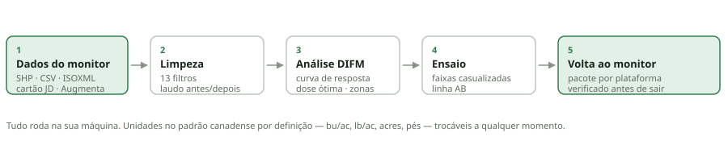

# AgroSuite

Aplicativo local para trabalhar com dados de monitores agrícolas: importar o
que vem da máquina, limpar mapas de colheita e de aplicação com laudo do que
foi removido, analisar ensaios em faixas no padrão DIFM e gerar os arquivos
de volta para o monitor — já no arranjo de pasta que cada terminal espera.

Roda inteiro no seu computador. Nenhum dado sai da máquina: o servidor
escuta só em `127.0.0.1` e os arquivos ficam numa pasta da sessão.



## Instalação no Windows

1. Instale o [Python 3.10 ou mais novo](https://www.python.org/downloads/),
   marcando **Add Python to PATH** durante a instalação.
2. Baixe ou clone esta pasta.
3. Dê um duplo-clique em **`run.bat`**.

Na primeira vez o script cria o ambiente e instala as dependências (alguns
minutos). Nas vezes seguintes o app abre direto no navegador.

No Linux ou no macOS, use `./run.sh`. Em qualquer sistema também funciona:

```
pip install -r requirements.txt
python -m agrosuite
```

## Unidades

O app abre no **padrão canadense**: bu/ac para grão, lb/ac para fertilizante
e semente, acres, pés, mph e dólar canadense. Dá para trocar tudo de uma vez
pelo seletor no topo (Canadá, Estados Unidos, Brasil, métrico puro) ou
ajustar cada grandeza pelo botão ⚙.

Por dentro, tudo é guardado em métrico — kg/ha, hectares, metros, km/h. A
conversão acontece só na exibição e na gravação, então trocar de acre para
hectare não altera nenhum número armazenado e não exige recarregar nada.

As unidades em bushel dependem da cultura, porque o bushel mede volume: um
bushel de milho pesa 25,40 kg e um de canola, 22,68 kg. Escolha a cultura no
mesmo painel.

## Os cinco passos

### 1 · Dados

Aceita o que o monitor produz:

| Origem | Formato |
|---|---|
| John Deere | shapefile e CSV do Operations Center, ZIP do pen drive, cartão GS2/GS3/Gen 4 |
| Ag Leader / SMS | shapefile e CSV |
| Raven Viper 4 | CSV de trabalho, shapefile |
| Trimble GFX / TMX / FmX | CSV de cobertura, shapefile |
| Case IH AFS, New Holland PLM | ISOXML (TASKDATA + logs TLG binários) |
| Bourgault X30/X35, Väderstad, Topcon/Müller | ISOXML, CSV |
| Augmenta | GeoJSON de sessão, com vigor e dose |
| Qualquer um | shapefile, GeoJSON, CSV/TXT, Excel, KML/KMZ, ZIP |

O app identifica o fabricante pela assinatura das colunas e pela estrutura de
pasta, converte tudo para um esquema único e reconstrói o que estiver
faltando — velocidade e rumo saem da própria trajetória quando o arquivo não
os traz.

Shapefile e pasta ISOXML precisam de todos os arquivos juntos: use **Abrir
por caminho / pasta**, ou envie um `.zip`.

### 2 · Limpeza

Treze filtros encadeados, com perfil inicial por tipo de operação:

- valores nulos e não positivos, posição inconsistente, umidade fora de faixa;
- velocidade fora da faixa operacional e variação brusca de velocidade;
- faixa parcial, passadas curtas, início e fim de passada;
- **sobreposição de faixas** — a principal fonte de valores baixos falsos num
  mapa de rendimento;
- **bordadura**, medida por transformada de distância sobre a área trabalhada,
  o que acompanha talhões de formato irregular;
- outliers globais e locais.

Antes dos filtros vem a correção de **atraso de fluxo**: do corte até o sensor
passam alguns segundos, e sem deslocar a série o mapa inteiro sai alguns
metros fora de lugar.

Nada é sobrescrito. A limpeza gera dois conjuntos novos — *limpo* e
*removidos*, este último com o motivo de cada descarte — e um laudo com
antes e depois, histograma sobreposto e o que cada filtro tirou.

### 3 · Análise DIFM

Agrega os pontos em células (sem nunca misturar doses de faixas vizinhas),
descarta a transição entre tratamentos, ajusta quatro modelos de resposta
— quadrática, quadrática com platô, linear com platô e Mitscherlich — e
escolhe o de melhor R².

Com preço do produto e custo do insumo, calcula a **dose econômica ótima**:
o ponto em que o quilo a mais de insumo deixa de se pagar. Com uma coluna de
zona, ajusta uma curva por zona e compara o lucro da taxa variável com o da
melhor dose única — que é o número que decide se vale a pena gerar o mapa.

### 4 · Desenhar ensaio

Gera faixas em blocos casualizados sobre o contorno do talhão: largura
múltipla do implemento, doses sorteadas dentro de cada bloco, direção
alinhada ao lado mais longo. Gera também a **linha AB** na direção das
faixas — sem ela, o operador entra noutro ângulo e o ensaio se perde.

### 5 · Exportar

Dois modos.

**Pacote pronto para o monitor** monta a pasta do pen drive no arranjo que a
plataforma escolhida procura, com contorno, linhas AB e prescrição, mais um
`LEIA-ME.txt` com o caminho de importação. O que a plataforma não aceita fica
de fora e é informado — melhor saber aqui do que na cabine.

**Arquivos avulsos** gera só o que você pedir, sem estrutura de pasta.

## Verificação antes de levar

Todo pacote passa por uma verificação automática, feita **sobre os arquivos já
gravados**, não sobre o que se pretendia gravar. Ela confere as causas
conhecidas de recusa, uma a uma:

- shapefile: `.shp`/`.shx`/`.dbf`/`.prj` presentes, geometria poligonal,
  polígonos válidos, projeção, nomes de campo dentro do limite do DBF, campo
  de dose existente, numérico, sem nulo e sem negativo, magnitude plausível,
  acentuação com codificação declarada, tamanho e quantidade de feições;
- ISOXML: pasta e arquivo com o nome exato, XML válido, anéis fechados,
  linhas AB com os dois pontos de referência, tamanho do binário da grade
  igual ao que o cabeçalho declara, células com dose, DDI declarado.

O resultado sai em três níveis: **conferido**, **a confirmar na tela do
monitor** e **impedimento**. Nada afirma "vai funcionar" — a verificação
afirma que as causas conhecidas de falha foram eliminadas. Versão de
firmware e menu de importação não dá para testar daqui.

## O que é proprietário e o que não é

O AgroSuite lê e escreve formatos abertos: shapefile, GeoJSON, CSV, KML e
ISOXML (ISO 11783-10), que é o padrão dos terminais ISOBUS.

Não escreve formatos proprietários. Os arquivos de setup dentro de
`GS2_2600/SETUP` ou `GS3_2630/SETUP`, `.gsd`, `.fdd`, `.jdf`, `.vy1` e
similares são fechados, e reconstruí-los por engenharia reversa produziria
arquivos que o display recusa na lavoura.

O que o app faz com eles: **inventaria o cartão**, diz o que cada arquivo é,
lê todas as camadas em formato aberto que estiverem lá dentro — contorno,
linhas, prescrições em shapefile — e explica o caminho de conversão quando
não há nada legível. Um contorno lido de um cartão GreenStar pode ser
reexportado para qualquer outro monitor sem redesenhar nada.

## Desenvolvimento

```
python -m pytest tests/ -q          # 67 testes
python tests/fixtures.py amostras   # gera arquivos de exemplo de cada monitor
python -m agrosuite --reload        # servidor com recarga automática
```

Os testes rodam contra arquivos que imitam a exportação real de cada
plataforma — mesmos nomes de coluna, mesmas unidades, mesma estrutura de
pasta. Se um fabricante mudar um nome de coluna, o teste correspondente
quebra e o alias é atualizado num lugar só.

### Organização

```
agrosuite/
  core/       modelo de dados, esquema de colunas, unidades, CRS, linhas AB
  formats/    leitura e escrita por formato, identificação de monitor,
              pacotes por plataforma, verificação
  clean/      filtros de limpeza e laudo
  difm/       modelos de resposta, economia, desenho de ensaio
  app/        servidor local e interface
```

## Licença

MIT.
